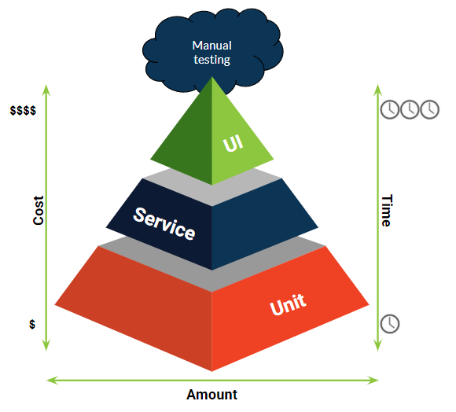
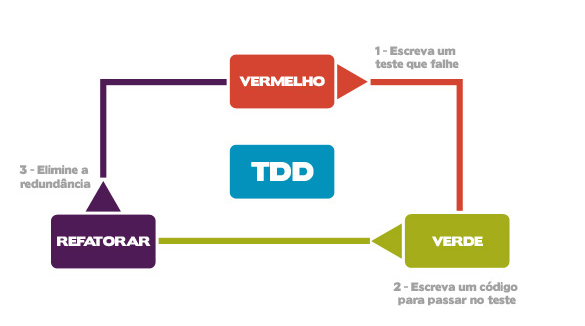

## Descrição

Este projeto consiste em um frontend que permite ao usuário carregar um arquivo Excel, que pode ser enviado esse mesmoa rquivo para um banco de dados, um bucket, um envio de email, várias coisas. E com esse carregamento é possível realizar diversas validações automáticas. As principais validações incluem:

- Verificação da corretude do formato de e-mail nos campos correspondentes;
- Garantia de que a coluna de números inteiros contém apenas valores inteiros;
- Confirmação de que a coluna de categoria está preenchida apenas com as categorias pré-definidas.

Quanto aos campos e suas características, seria ideal fazer uma negociação com os usuários para determinar o tipo de cada campos desse Excel. Através do input fornecido no arquivo Excel, é possível realizar uma validação preliminar para verificar se os critérios estabelecidos estão sendo atendidos, antes de qualquer tratativa com estes dados.

Além disso, o projeto incorpora testes de validação de código utilizando o pytest para garantir a robustez e a confiabilidade das funcionalidades implementadas.

## Precisamos falar de testes

 Se você, assim como eu, já ouviu as frases a seguir, então [esse artigo é para você](https://www.zup.com.br/blog/tipos-de-teste)

- “fulano sabe teste funcional e não automatizado”;
- “desenvolva o teste unitário antes dos funcionais”;
- “precisamos que os testes sejam 100% automatizados”;
- “cadê a massa de dados para os testes de contrato?”




## Configuração inicial

1) Vamos definir nossa versão do Python usando o Pyenv

```bash
python --version
pyenv versions
pyenv local 3.11.5
```

2) Vamos configurar o nosso ambiente virtual

```bash
python -m venv nome_do_ambiente_virtual 
# O padrao é utilizar .venv

source nome_do_ambiente_virtual/bin/activate
# Usuários Linux e mac

nome_do_ambiente_virtual\Scripts\Activate
# Usuários Windows
```

3) Replicando ambientes, se quisermos rodar o nosso projeto em outra máquina, não será necessário baixar as dependências uma a uma, basta fazer:

```bash
pip freeze > requirements.txt
pip install -r requirements.txt
```

4) Rode o projeto
```bash
streamlit run src/app.py
```

5) Rode os testes
```bash
pytest tests
```